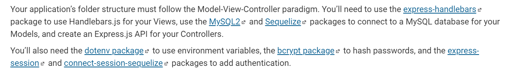

# Tech Blog
 
## Table of Contents
* [Project Title](#Project-Title)
* [Description](#Description)
* [Installation instructions](#Installation-instructions)
* [Usage Information](#Usage-Information)
* [Contribution Guidelines](#Contribution-Guidelines)
* [Test Instructions](#Test-Instructions)
* [License](#License)
* [Questions](#Questions)

## Description
* This is a Tech Blog. You can create, read, update and delete some comment on a tech blog. 

## Installation instructions
 

## Usage Information
* This Tech Blog is for personal and professional use.

## Contribution Guidelines
* This is a final product, that is ready to be use.
* [Tech Blog-Page-Ressources Git Hub](https://github.com/MiguelJerome/Tech-Blog)
* [Tech Blog-Page-Ressources Heroku](https://safe-brushlands-75061.herokuapp.com/)

## Test Instructions
* This Tech Blog works and is ready to be use.

## License
* MIT License

Copyright (c) [2022] [Miguel Jerome]

Permission is hereby granted, free of charge, to any person obtaining a copy
of this software and associated documentation files (the "Software"), to deal
in the Software without restriction, including without limitation the rights
to use, copy, modify, merge, publish, distribute, sublicense, and/or sell
copies of the Software, and to permit persons to whom the Software is
furnished to do so, subject to the following conditions:

The above copyright notice and this permission notice shall be included in all
copies or substantial portions of the Software.

THE SOFTWARE IS PROVIDED "AS IS", WITHOUT WARRANTY OF ANY KIND, EXPRESS OR
IMPLIED, INCLUDING BUT NOT LIMITED TO THE WARRANTIES OF MERCHANTABILITY,
FITNESS FOR A PARTICULAR PURPOSE AND NONINFRINGEMENT. IN NO EVENT SHALL THE
AUTHORS OR COPYRIGHT HOLDERS BE LIABLE FOR ANY CLAIM, DAMAGES OR OTHER
LIABILITY, WHETHER IN AN ACTION OF CONTRACT, TORT OR OTHERWISE, ARISING FROM,
OUT OF OR IN CONNECTION WITH THE SOFTWARE OR THE USE OR OTHER DEALINGS IN THE
SOFTWARE.

## Questions
* [MiguelJerome](https://github.com/MiguelJerome/) Github
* [Contact Us](mailto:2001326@collegelacite.ca) Email
* How to reach me : You can contact me by email or github